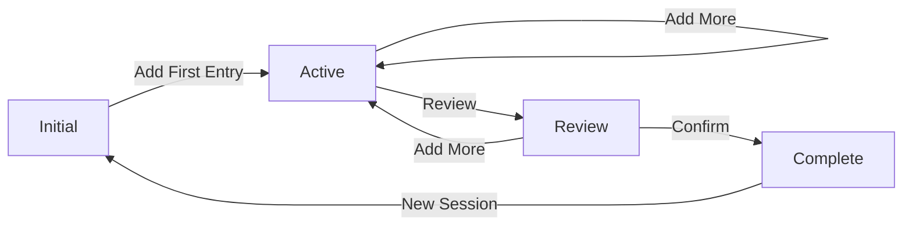

# Static-State Design

**Framework:** FnMCP.IvanTheGeekDevFramework  
**Pattern:** One Screen = One State  
**Updated:** 2025-01-15  
**Status:** Core Design Pattern

## The Principle

**Each screen represents exactly one discrete state.** No hidden modes, no complex state machines, no surprising behaviors. When users look at a screen, they know exactly what state the application is in and what they can do.

## Why Static-State?

### Traditional Problems

Most applications suffer from state explosion:
- Hidden modes change behavior invisibly
- Complex state machines are hard to reason about
- Edge cases multiply exponentially
- Testing becomes combinatorial nightmare
- Users get confused about what's happening

### The Solution

**Make every state visible:**
```
Traditional: One screen with 5 modes = 5 states to test
Static-State: 5 screens with 1 mode each = 5 states to test
```

The complexity doesn't disappear, but it becomes:
- **Visible** - Users see which state they're in
- **Testable** - Each screen tested independently
- **Documentable** - Screenshots show all states
- **Predictable** - No hidden behaviors

## Core Concepts

### State Definition

A state consists of:
- **Visual representation** - What the user sees
- **Available actions** - What the user can do
- **Data context** - What information is present
- **Navigation options** - Where the user can go

### State Transitions

Moving between states is always explicit:
```
SessionEntry_Initial → (Add Entry) → SessionEntry_WithEntries
SessionEntry_WithEntries → (Complete) → Session_Complete
Session_Complete → (New Session) → SessionEntry_Initial
```

Never:
```
SessionEntry + hidden flag + mode indicator = ???
```

## Implementation Patterns

### Screen Naming Convention

Each screen name encodes its state:
```
Purpose_Action_State

Examples:
- SessionEntry_Add_Initial (empty session, adding first)
- SessionEntry_Add_Multiple (has entries, adding more)
- SessionEntry_Review_Complete (reviewing before submit)
- SessionEntry_Edit_Single (editing one entry)
```

### URL Routing

URLs reflect the exact state:
```
/session/new                    → SessionEntry_Add_Initial
/session/{id}/add              → SessionEntry_Add_Multiple
/session/{id}/review           → SessionEntry_Review_Complete
/session/{id}/entry/{entryId}/edit → SessionEntry_Edit_Single
```

### State Validation

Each state validates its prerequisites:
```fsharp
let renderScreen (state: AppState) (route: Route) =
    match route with
    | AddEntry sessionId ->
        match Map.tryFind sessionId state.Sessions with
        | Some session -> renderAddEntryScreen session
        | None -> redirectTo SessionNew
    | ReviewSession sessionId ->
        match Map.tryFind sessionId state.Sessions with
        | Some session when session.Entries.Length > 0 ->
            renderReviewScreen session
        | Some _ -> redirectTo (AddEntry sessionId)
        | None -> redirectTo SessionNew
```

## Practical Examples

### LaundryLog States

**Initial State:** `SessionEntry_Add_Initial`
- No entries exist
- Location capture active
- All fields empty
- "Start Session" button

**Active State:** `SessionEntry_Add_Multiple`
- Entries exist in list
- Running total displayed
- "Add Another" and "Complete" buttons
- Can edit existing entries

**Review State:** `SessionEntry_Review_Complete`
- All entries shown
- Total calculated
- Validation complete
- "Confirm" and "Add More" buttons

**Complete State:** `Session_Complete`
- Session saved
- Receipt available
- "New Session" and "Export" buttons
- Cannot modify entries

### State Transitions



## Design Benefits

### For Users

**Always know where you are:**
- Screen title reflects state
- Available actions are clear
- No surprise mode changes
- Predictable navigation

**Reduce cognitive load:**
- One decision at a time
- Clear progression through workflow
- No hidden complexity
- Visual confirmation of state

### For Developers

**Simplified testing:**
```fsharp
[<Test>]
let ``Initial screen shows empty state`` () =
    let screen = renderInitialScreen()
    screen |> shouldHaveNoEntries
    screen |> shouldShowStartButton
    screen |> shouldNotShowCompleteButton

[<Test>]
let ``Active screen shows entries`` () =
    let screen = renderActiveScreen testSession
    screen |> shouldShowEntries testSession.Entries
    screen |> shouldShowRunningTotal
    screen |> shouldShowCompleteButton
```

**Clear component boundaries:**
```fsharp
type Screen =
    | SessionInitial
    | SessionActive of Session
    | SessionReview of Session
    | SessionComplete of CompletedSession
    
let render screen =
    match screen with
    | SessionInitial -> InitialComponent.render()
    | SessionActive session -> ActiveComponent.render session
    | SessionReview session -> ReviewComponent.render session
    | SessionComplete result -> CompleteComponent.render result
```

## Anti-Patterns to Avoid

### Hidden Modes

❌ **Bad:** Single screen with edit mode flag
```javascript
// Bad: Hidden complexity
if (isEditMode && hasPermission && !isReadOnly) {
    showEditButtons();
} else if (isViewMode || isReadOnly) {
    hideEditButtons();
}
```

✅ **Good:** Separate screens for view and edit
```fsharp
// Good: Explicit states
type Screen =
    | ViewEntry of Entry
    | EditEntry of Entry * EditPermissions
```

### Modal State Explosion

❌ **Bad:** Modals over modals
```
Main Screen
  ├── Edit Modal
  │   ├── Confirm Modal
  │   │   └── Error Modal
```

✅ **Good:** Full screen states
```
Main Screen → Edit Screen → Confirm Screen
            ↘ Error Screen ↗
```

### Conditional Rendering Chaos

❌ **Bad:** Complex conditionals
```jsx
{showHeader && !isLoading && (hasData || isError) && (
    <Header>
        {isError ? <Error /> : <Data />}
    </Header>
)}
```

✅ **Good:** Explicit states
```fsharp
match state with
| Loading -> LoadingScreen.render()
| Error e -> ErrorScreen.render e
| Success data -> SuccessScreen.render data
```

## State Management in F#/Elmish

### Model Definition
```fsharp
type Model =
    | NotStarted
    | SessionInProgress of SessionInProgress
    | SessionReview of SessionReview
    | SessionCompleted of CompletedSession

and SessionInProgress = {
    Id: SessionId
    Location: Location
    Entries: Entry list
    StartTime: DateTime
}

and SessionReview = {
    Session: SessionInProgress
    Validation: ValidationResult
}
```

### Update Function
```fsharp
let update msg model =
    match model, msg with
    | NotStarted, StartSession location ->
        SessionInProgress {
            Id = SessionId.create()
            Location = location
            Entries = []
            StartTime = DateTime.Now
        }
    
    | SessionInProgress session, AddEntry entry ->
        SessionInProgress {
            session with Entries = entry :: session.Entries
        }
    
    | SessionInProgress session, ReviewSession ->
        SessionReview {
            Session = session
            Validation = validateSession session
        }
    
    | SessionReview review, ConfirmSession ->
        SessionCompleted (completeSession review.Session)
    
    | _, _ ->
        model // Invalid transition, stay in current state
```

### View Function
```fsharp
let view model dispatch =
    match model with
    | NotStarted ->
        SessionStart.view dispatch
    
    | SessionInProgress session ->
        SessionActive.view session dispatch
    
    | SessionReview review ->
        SessionReviewView.view review dispatch
    
    | SessionCompleted completed ->
        SessionComplete.view completed dispatch
```

## Testing Strategy

### State-Based Testing

Test each state independently:
```fsharp
[<Test>]
let ``Each state renders correctly`` () =
    let states = [
        NotStarted
        SessionInProgress testSession
        SessionReview testReview
        SessionCompleted testCompleted
    ]
    
    states |> List.iter (fun state ->
        let view = render state
        view |> shouldBeValid
        view |> shouldHaveUniqueElements
        view |> shouldHaveProperNavigation
    )
```

### Transition Testing

Test valid state transitions:
```fsharp
[<Test>]
let ``Valid transitions succeed`` () =
    let transitions = [
        (NotStarted, StartSession location, isSessionInProgress)
        (SessionInProgress session, AddEntry entry, isSessionInProgress)
        (SessionInProgress session, ReviewSession, isSessionReview)
        (SessionReview review, ConfirmSession, isSessionCompleted)
    ]
    
    transitions |> List.iter testTransition
```

## Integration with Event Modeling

### Events Map to States

Each state transition produces events:
```
NotStarted → SessionStarted → SessionInProgress
SessionInProgress → EntryAdded → SessionInProgress (updated)
SessionInProgress → ReviewRequested → SessionReview
SessionReview → SessionConfirmed → SessionCompleted
```

### State Machines from Event Models

Generate state machines from Event Model paths:
```fsharp
let generateStateMachine (eventModel: EventModel) =
    eventModel.Paths
    |> List.map extractStates
    |> combineIntoStateMachine
    |> validateCompleteness
```

## Best Practices

### Keep States Shallow

Avoid nested state machines:
```fsharp
// Bad: Nested states
type Model = {
    Screen: Screen
    Modal: Modal option
    Popup: Popup option
    Drawer: Drawer option
}

// Good: Flat states
type Model =
    | MainScreen
    | SettingsScreen
    | EntryEditScreen of Entry
    | ConfirmationScreen of Action
```

### Make Invalid States Unrepresentable

Use types to prevent invalid combinations:
```fsharp
// Can't have completed session with no entries
type CompletedSession = private CompletedSession of {
    Entries: NonEmptyList<Entry>
    Total: PositiveDecimal
    CompletedAt: DateTime
}

module CompletedSession =
    let create entries total =
        match entries with
        | [] -> Error "Cannot complete empty session"
        | entries -> Ok (CompletedSession {
            Entries = NonEmptyList.create entries
            Total = total
            CompletedAt = DateTime.Now
        })
```

### Document State Diagrams

Keep visual documentation:
- State diagram in Mermaid/PlantUML
- Screenshots of each state
- Transition matrix
- Invalid transition handling

## Key Takeaways

1. **Every screen is a complete state** - No hidden modes
2. **Transitions are explicit** - Users trigger them
3. **States are testable** - Each in isolation
4. **Invalid states impossible** - Type system enforces
5. **Navigation is predictable** - Users never lost
6. **Complexity is visible** - Not hidden in conditionals

---

*Static-state design transforms complex state management into a series of simple, discrete screens. This makes applications more predictable for users and more maintainable for developers.*